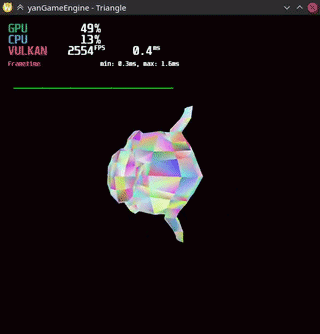
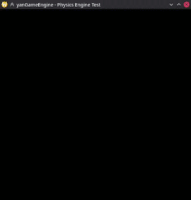

# yanGameEngine
Yet Another Nameless Game Engine with no actual goal.

# Platform support
Currently only Linux with wayland compositor is supported. Windows support will be added in future.
# Prerequisites
## Linux
1. Install these using package manager: **gcc**, **libxkbcommon**, **wayland-client**
2. Download and place **VulkanSDK** into lib folder or install using package manager
# Building & Running
```
$ make
$ make run
```

# Demos
|  |  |
| ------------- |-------------:|