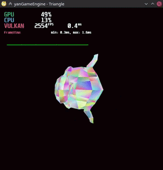
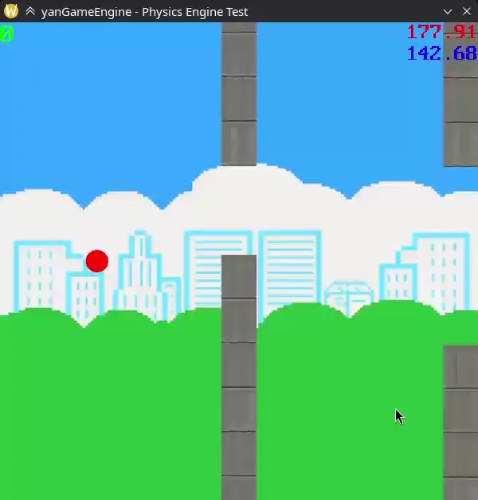
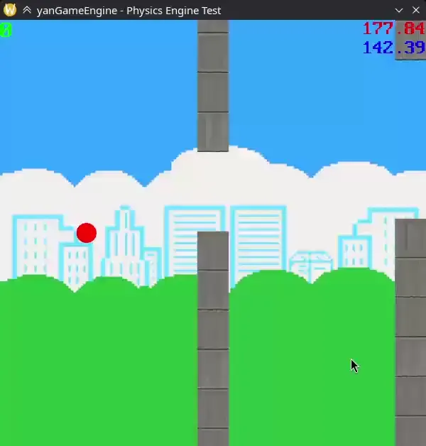
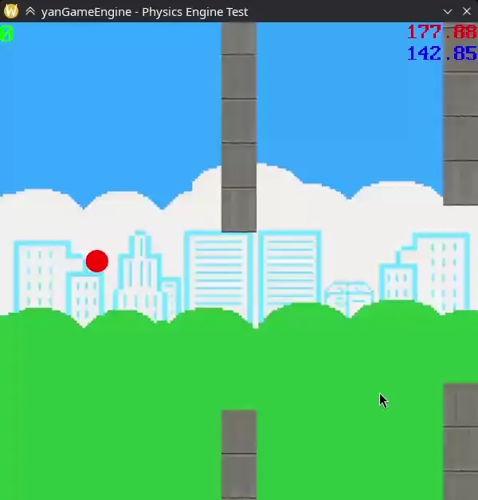

# yanGameEngine
Yet Another Nameless Game Engine with no actual goal.

# Platform support
Currently only Linux with wayland compositor is supported. Windows support will be added in future.
# Prerequisites
## Linux
1. **gcc**, **libxkbcommon**, **wayland-client**(optional)
2. Download and place **Vulkan**, **GLFW** library into **libs** folder or install using package manager
# Building & Running
```
$ make
$ make run
```

# Demos
|  |  |
|-|-:|
|||
|||